<h1>📰 News App</h1>

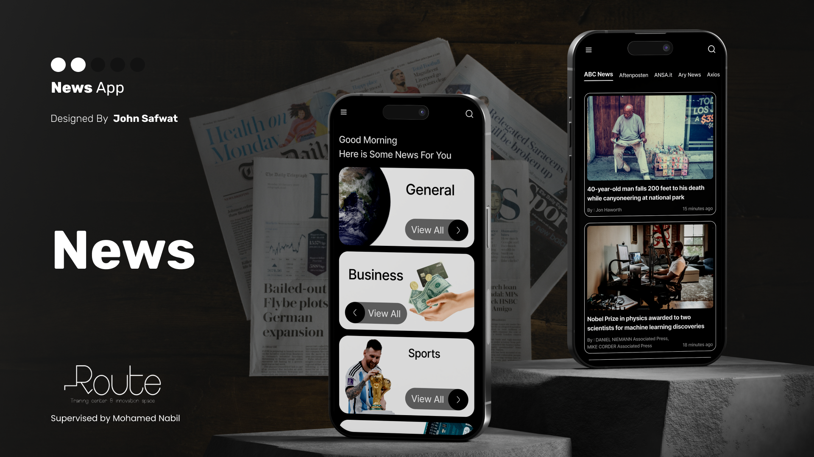

<b>News App</b> is a modern Flutter application that allows users to browse and explore the latest news from various sources around the world.  
The app provides categorized news, source-based browsing, and powerful search functionality — making it easy to stay updated anytime. 🌍✨

<h2>🚀 Features</h2>

<ul>
  <li>
    <b>News Categories</b>
    <ul>
      <li>Select different categories (Business, Sports, Technology, etc.) 🗂️</li>
      <li>Each category displays available news sources</li>
    </ul>
  </li>

  <li>
    <b>Sources & Articles</b>
    <ul>
      <li>View news sources related to the selected category 📰</li>
      <li>Browse articles under each source</li>
      <li>Clean and organized UI for better readability</li>
    </ul>
  </li>

  <li>
    <b>Search Functionality</b>
    <ul>
      <li>Search for news using keywords 🔍</li>
      <li>Instant results from multiple sources</li>
    </ul>
  </li>

  <li>
    <b>Article Details</b>
    <ul>
      <li>Read full article details</li>
      <li>Open full article in browser inside the app 🌐</li>
    </ul>
  </li>

  <li>
    <b>Localization & Settings</b>
    <ul>
      <li>Multi-language support 🌍</li>
      <li>Save preferences locally</li>
    </ul>
  </li>
</ul>

<h2>📸 Screenshots</h2>

<table>
  <tr>
    <td>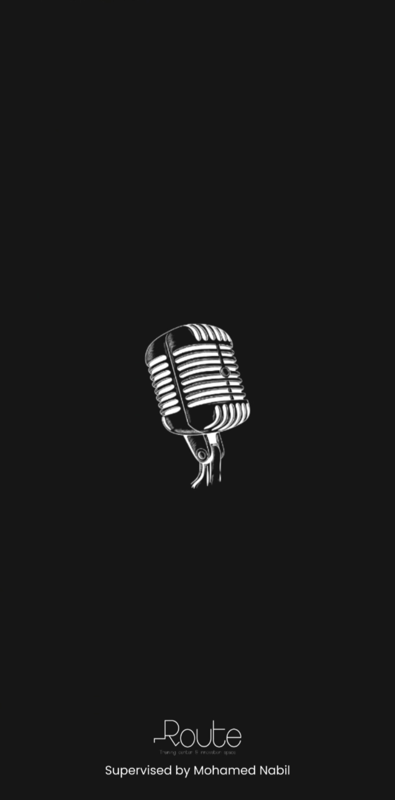</td>
    <td>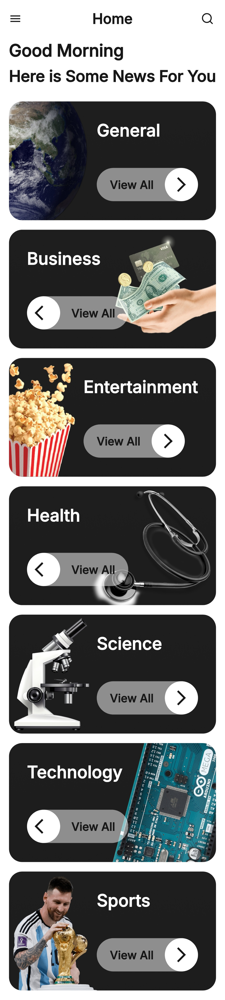</td>
    <td>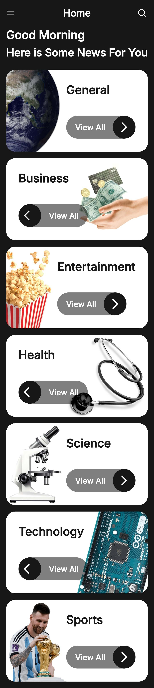</td>
  </tr>
  <tr>
    <td>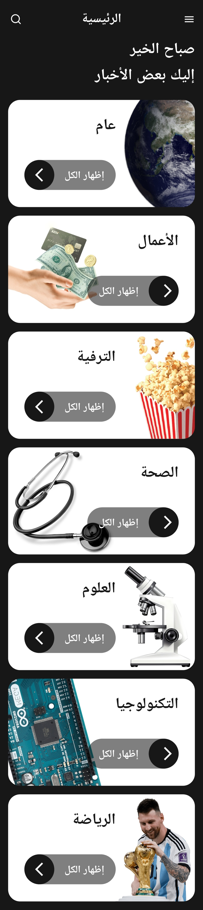</td>
    <td>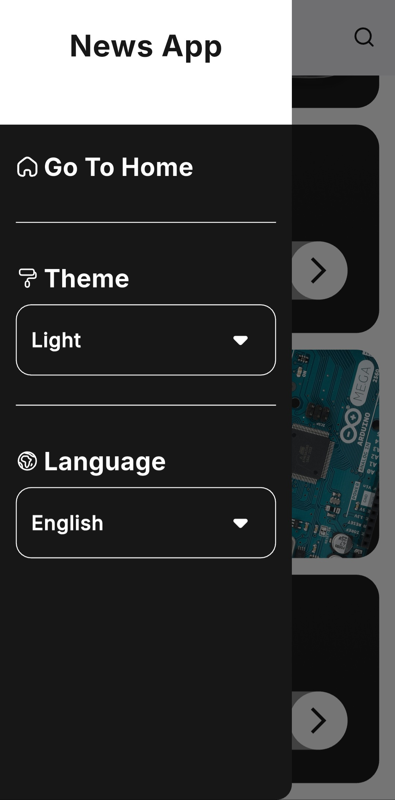</td>
    <td>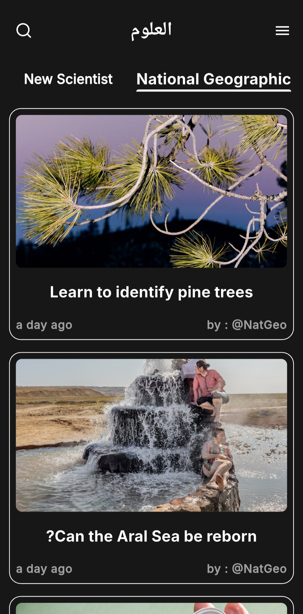</td>
  </tr>
  <tr>
    <td>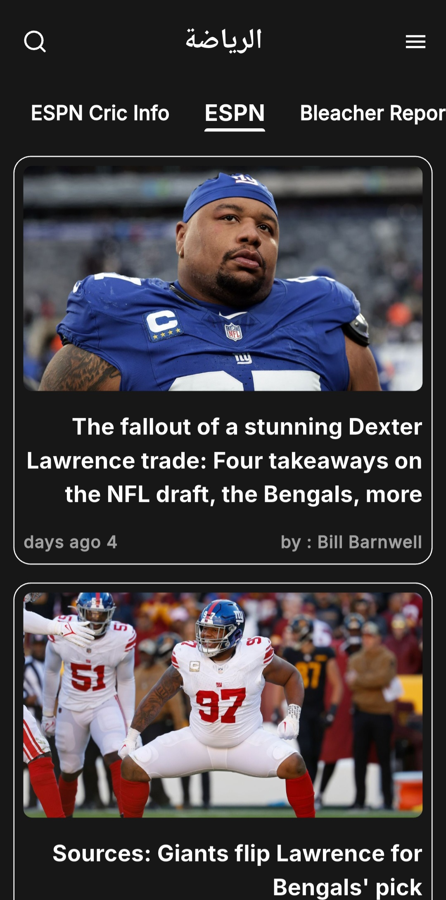</td>
    <td>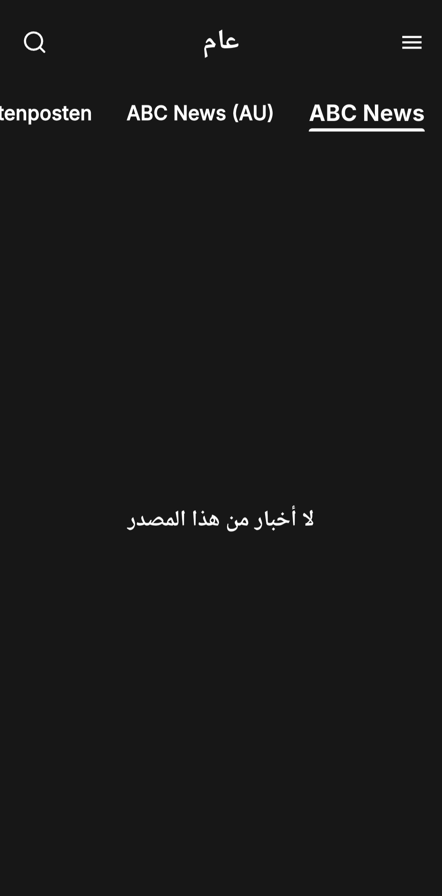</td>
    <td>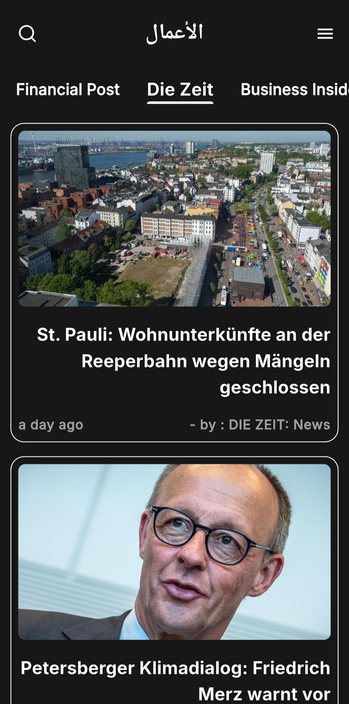</td>
  </tr>
  <tr>
    <td>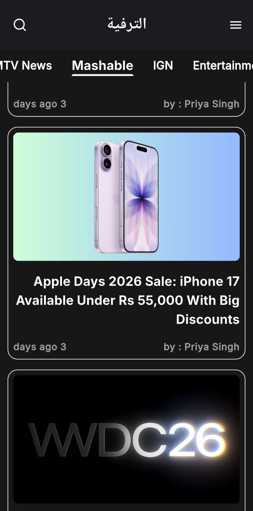</td>
    <td>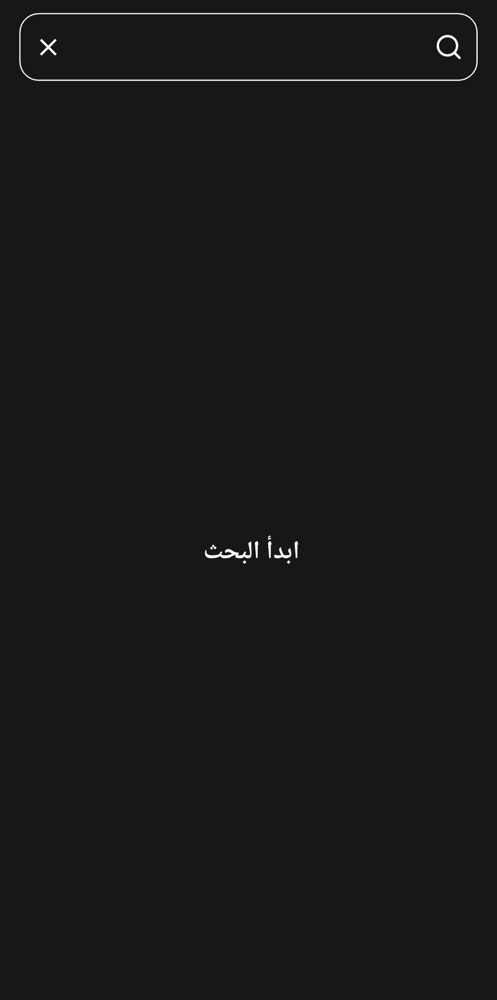</td>
    <td>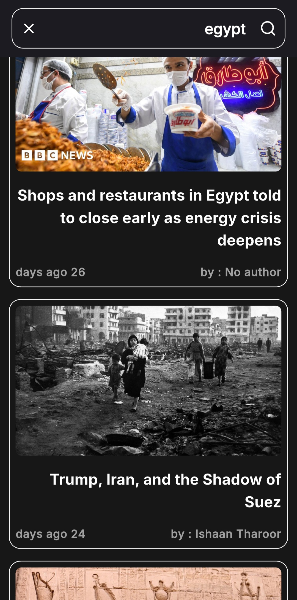</td>
  </tr>
  <tr>
    <td>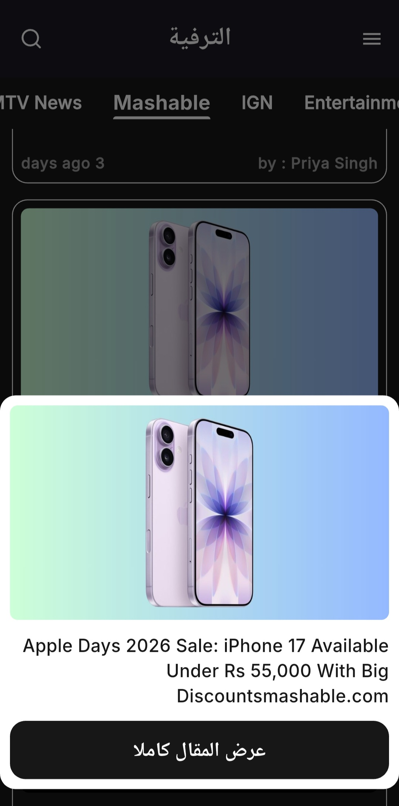</td>
    <td>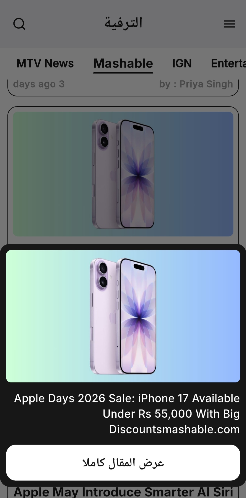</td>
    <td>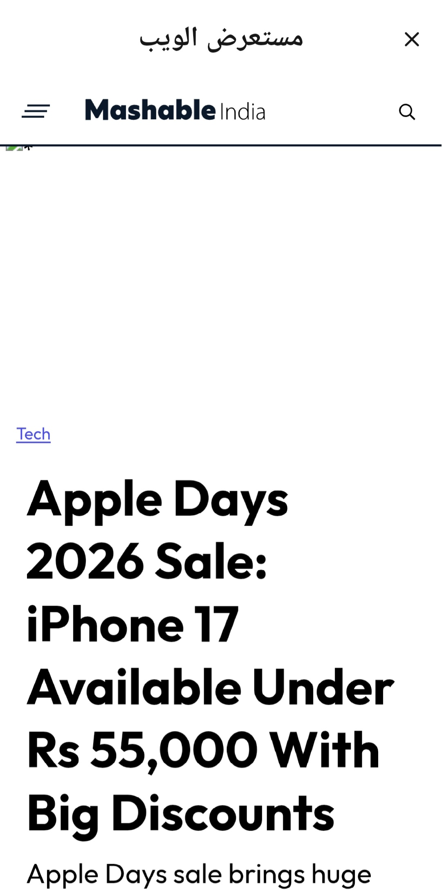</td>
  </tr>
</table>

<h2>📦 Packages Used</h2>

<h3>🎨 UI & Design</h3>
<ul>
  <li><b>flutter_svg</b> - Display SVG icons and assets.</li>
  <li><b>cached_network_image</b> - Efficient image loading and caching.</li>
</ul>

<h3>🌍 Localization</h3>
<ul>
  <li><b>easy_localization</b> - Multi-language support.</li>
</ul>

<h3>🧠 State Management</h3>
<ul>
  <li><b>provider</b> - Manage app state (categories, sources, news).</li>
</ul>

<h3>🌐 Networking</h3>
<ul>
  <li><b>http</b> - Fetch news data from APIs.</li>
</ul>

<h3>💾 Local Storage</h3>
<ul>
  <li><b>shared_preferences</b> - Store user preferences.</li>
</ul>

<h3>🕒 Time Handling</h3>
<ul>
  <li><b>timeago_flutter</b> - Display publish time in a human-readable format.</li>
</ul>

<h3>🌐 Web View</h3>
<ul>
  <li><b>webview_flutter</b> - Open full news articles.</li>
</ul>

<h3>🚀 Splash Screen</h3>
<ul>
  <li><b>flutter_native_splash</b> - Customize app launch screen.</li>
</ul>

<h2>🛠 Installation & Run</h2>

<pre>
git clone https://github.com/abdallahelnshar123-ux/news.git
cd news
flutter pub get
flutter run
</pre>

<h2>👨‍💻 Author & License</h2>

**Abdallah Samir Elnshar**

This app is part of a series of projects developed during my journey at **Route Academy**.  
Thank you for checking out my work! 🙏

This project is open source and available under the **MIT License**.
